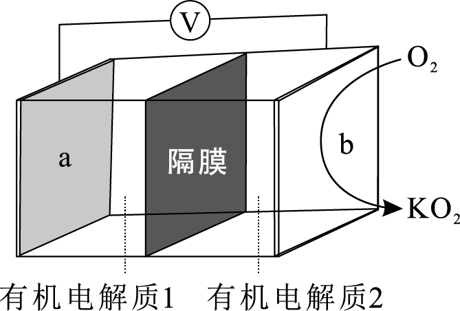
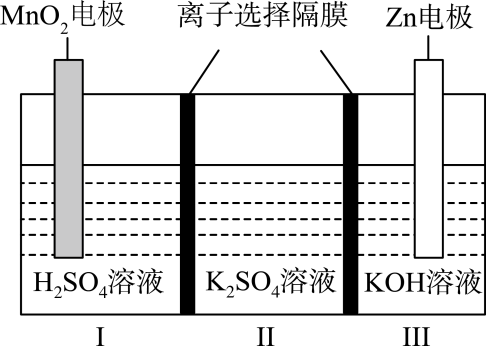
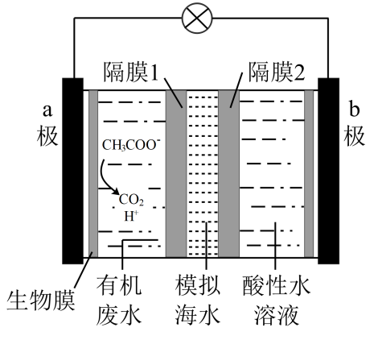
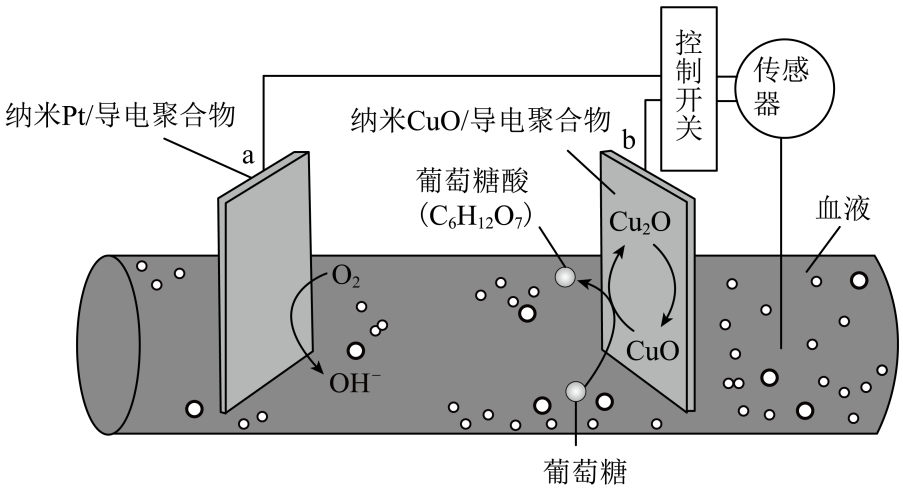
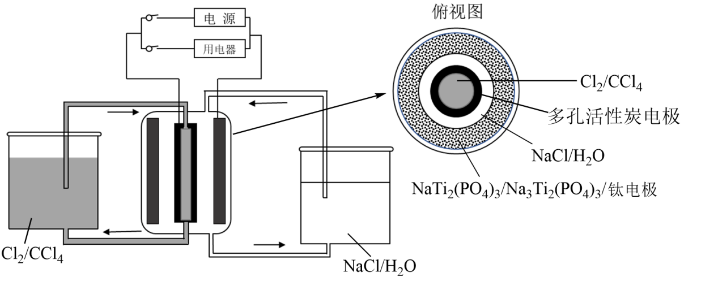
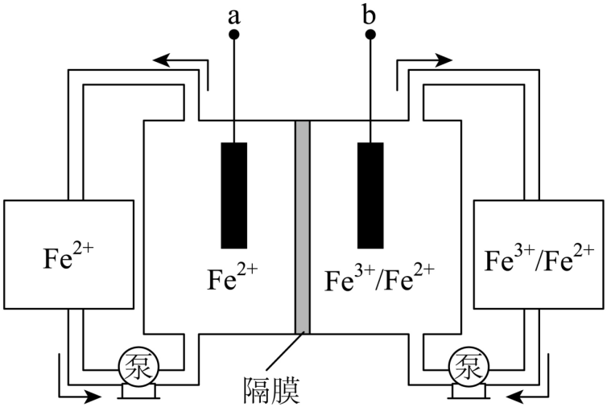
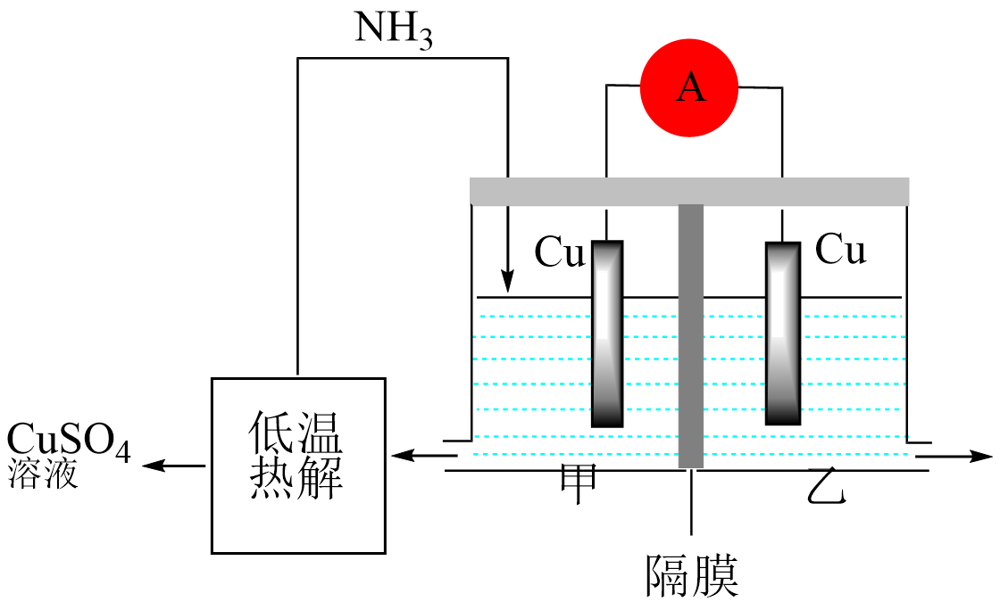
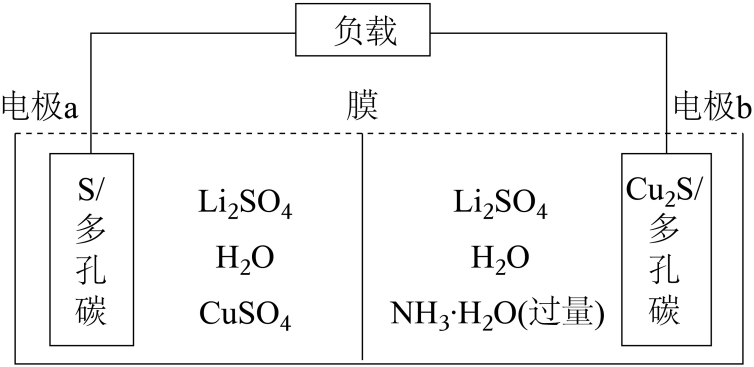

# 原电池高考题（陆老师选题）——完整转录

来源：陆老师提供《原电池（选题）.docx》（原件存 [`original/`](original/原电池（选题）.docx)）
转录日期：2026-07-22
转录说明：正文、图片、嵌入公式全量抽取。原文档中 6 处公式为 MathType OLE 对象（WMF 渲染），已解析其文本记录并结合装置图交叉验证后重建为行内文本，重建处以「※」标注。原文档 image1.png 为 3×3 像素装饰点，非内容，未收录。「对应量表指标」为**教师手标原文照录**；核对意见另见 [`annotation-review.md`](annotation-review.md)。
**评分关键词效力**：2026-07-22 起以陆老师解析版 [`answer-key.md`](answer-key.md) 为准，本文件的关键词仅为 docx 原文存档（差异清单见 answer-key.md 文末）。

---

## 第 1 题　K—O₂ 电池

K—O₂ 电池结构如图，a 和 b 为两个电极，其中之一为单质钾片。

> 图：立方体电池示意，左侧板为电极 a，中间为隔膜，右侧板为电极 b；b 侧标注 O₂ 进入、生成 KO₂。两侧电解质分别标注「有机电解质1」（a 侧）、「有机电解质2」（b 侧），顶部经电压表 V 连接。

- **1-1** 该电池中，电极 a 为______极，电极 b 为______极。
- **1-2** 放电时，外电路中电子从______极流向______极（填"a"或"b"）。
- **1-3** 该电池放电时，消耗 K 与消耗 O₂ 的物质的量之比为______。
- **1-4** 该装置中的隔膜能否通过 O₂？请说明理由。

**对应量表指标**（教师手标）：

| 小题 | 指标 |
|---|---|
| 1-1 | D1、D4 |
| 1-2 | P4、D4 |
| 1-3 | E3、P4 |
| 1-4 | D3、D5 |

**评分关键词**：

- 1-1："负"、"正"
- 1-2："a"、"b"
- 1-3："1:1"
- 1-4："不能"、"防止 K 与 O₂ 直接反应"、"隔膜只允许 K⁺ 通过"

## 第 2 题　Zn-MnO₂ 双隔膜电池

一种水性电解液 Zn-MnO₂ 离子选择双隔膜电池如图所示（KOH 溶液中，Zn²⁺ 以 Zn(OH)₄²⁻ ※ 存在）。

> 图：三室槽。Ⅰ室 MnO₂ 电极浸入 H₂SO₄ 溶液，Ⅱ室 K₂SO₄ 溶液，Ⅲ室 Zn 电极浸入 KOH 溶液；Ⅰ/Ⅱ、Ⅱ/Ⅲ 之间各一片离子选择隔膜。

- **2-1** 该电池中，Zn 电极为______极，MnO₂ 电极为______极。
- **2-2** 写出该电池负极的电极反应式。
- **2-3** 放电时，Ⅱ区的 K⁺ 通过隔膜向______区（填"Ⅰ"或"Ⅲ"）迁移。
- **2-4** 该装置将______转化为______。

**对应量表指标**（教师手标）：

| 小题 | 指标 |
|---|---|
| 2-1 | D1、D4 |
| 2-2 | P6、P2、P3 |
| 2-3 | P4、D3 |
| 2-4 | E1、E2、E3 |

**评分关键词**：

- 2-1："负"、"正"
- 2-2："Zn − 2e⁻ + 4OH⁻ = Zn(OH)₄²⁻"
- 2-3："Ⅰ"
- 2-4："化学能"、"电能"

## 第 3 题　微生物脱盐电池

微生物脱盐电池是一种高效、经济的能源装置，利用微生物处理有机废水获得电能，同时可实现海水淡化。现以 NaCl 溶液模拟海水，采用惰性电极，用下图装置处理有机废水（以含 CH₃COO⁻ 的溶液为例）。

> 图：三室槽，外接灯泡。左：a 极，内侧生物膜，有机废水室（CH₃COO⁻ → CO₂、H⁺）；中：模拟海水室，两侧为隔膜 1（左）、隔膜 2（右）；右：酸性水溶液室，b 极。

- **3-1** 该电池中，电极 a 为______极，电极 b 为______极。
- **3-2** 写出该电池负极的电极反应式。
- **3-3** （1）该装置中，隔膜 1 为______离子交换膜，隔膜 2 为______离子交换膜（填"阳"或"阴"）。（2）请写出你的判断依据。
- **3-4** 当电路中转移 1 mol 电子时，模拟海水理论上除盐______g。（保留一位小数）

**对应量表指标**（教师手标）：

| 小题 | 指标 |
|---|---|
| 3-1 | D1、D4 |
| 3-2 | P6、P2、P3 |
| 3-3 | D3、P4、P2 |
| 3-4 | E3、P4、D3 |

**评分关键词**：

- 3-1："负"、"正"
- 3-2："CH₃COO⁻ + 2H₂O − 8e⁻ = 2CO₂↑ + 7H⁺"
- 3-3：（1）"阴"、"阳"；（2）要实现海水淡化，"Cl⁻ 移向负极（a 极）"、"Na⁺ 移向正极（b 极）"
- 3-4："58.5"

## 第 4 题　血糖微型电池

一种可植入体内的微型电池工作原理如图所示，通过 CuO 催化消耗血糖发电，从而控制血糖浓度。当传感器检测到血糖浓度高于标准，电池启动。血糖浓度下降至标准，电池停止工作。（血糖浓度以葡萄糖浓度计）

> 图：血管内两片电极。a 极为纳米 Pt/导电聚合物，标注 O₂ → OH⁻；b 极为纳米 CuO/导电聚合物，标注 CuO ⇄ Cu₂O 循环、葡萄糖 → 葡萄糖酸（C₆H₁₂O₇）；外接控制开关与传感器。

- **4-1** 该电池中，电极 a 为______极，电极 b 为______极。
- **4-2** 写出该电池正极的电极反应式。
- **4-3** （1）b 电极的电极材料是什么？（2）在 b 电极上，实际失电子的物质是什么？（3）请写出 CuO 在 b 电极上参与反应的完整过程（简单描述），并说明 CuO 在该过程中所起的作用。
- **4-4** 消耗 18 mg 葡萄糖（C₆H₁₂O₆，M=180 g/mol）时，理论上 a 电极有______mmol 电子流入。

**对应量表指标**（教师手标）：

| 小题 | 指标 |
|---|---|
| 4-1 | D1、D4 |
| 4-2 | P6、P2 |
| 4-3 | D1、D5、P2 |
| 4-4 | P4、E3 |

**评分关键词**：

- 4-1："正"、"负"
- 4-2："O₂ + 2H₂O + 4e⁻ = 4OH⁻"
- 4-3：（1）"CuO"；（2）"Cu₂O"；（3）氧化铜将葡萄糖氧化为葡萄糖酸，自身被还原为氧化亚铜，氧化亚铜在 b 电极失电子又生成氧化铜。"催化作用"
- 4-4："0.2"

## 第 5 题　钠-氯储能电池

某储能电池原理如图。

> 图：左烧杯 Cl₂/CCl₄，右烧杯 NaCl/H₂O，经泵与中央电池体循环；电池外接电源/用电器。俯视图（同心圆，由内向外）：Cl₂/CCl₄ → 多孔活性炭电极 → NaCl/H₂O → NaTi₂(PO₄)₃/Na₃Ti₂(PO₄)₃/钛电极。

- **5-1** 写出放电时该电池的负极反应式。
- **5-2** 放电时，Cl⁻ 透过多孔活性炭电极向______（填"NaCl 溶液"或"CCl₄"）中迁移。
- **5-3** 放电时，每转移 1 mol 电子，理论上 CCl₄ 层______（填"吸收"或"释放"）______g Cl₂。
- **5-4** 该电池没有使用离子交换膜或盐桥。请观察装置图，分析它是通过什么方式实现两电极反应物分隔的？

**对应量表指标**（教师手标）：

| 小题 | 指标 |
|---|---|
| 5-1 | P6、P2 |
| 5-2 | P4、D3 |
| 5-3 | P4、E3 |
| 5-4 | D3、D5 |

**评分关键词**：

- 5-1："Na₃Ti₂(PO₄)₃ − 2e⁻ = NaTi₂(PO₄)₃ + 2Na⁺" ※
- 5-2："NaCl 溶液"
- 5-3："释放"、"35.5"
- 5-4：NaCl 溶液和 CCl₄ 不互溶，Cl₂ 易溶于 CCl₄、难溶于 NaCl 溶液，使得 Cl 无法与 Na₃Ti₂(PO₄)₃ 接触。

## 第 6 题　全铁液流电池

全铁液流电池工作原理如图所示，两电极分别为石墨电极和负载铁的石墨电极。

> 图：双室槽中间隔膜。左室电极 a，电解液 Fe²⁺（外接 Fe²⁺ 储罐与泵循环）；右室电极 b，电解液 Fe³⁺/Fe²⁺（外接储罐与泵循环）。

- **6-1** （1）放电时，a 电极为______极，该电极的电极反应式为？（2）放电时，b 电极为______极，该电极的电极反应式为？（3）写出该电池放电时的总反应离子方程式。
- **6-2** （1）该电池的隔膜为______离子交换膜（填"阳"或"阴"）。（2）请写出你的判断依据。
- **6-3** 放电时，每消耗 1 mol Fe³⁺，理论上生成 Fe²⁺ 的物质的量为______mol。

**对应量表指标**（教师手标）：

| 小题 | 指标 |
|---|---|
| 6-1 | D1、D4、P2、P6 |
| 6-2 | D3、P4 |
| 6-3 | P4、E3 |

**评分关键词**：

- 6-1（1）："负"、"Fe − 2e⁻ = Fe²⁺"
- 6-1（2）："正"、"2Fe³⁺ + 2e⁻ = 2Fe²⁺"
- 6-1（3）："Fe + 2Fe³⁺ = 3Fe²⁺"
- 6-2（1）："阴"
- 6-2（2）："若为阳膜，电池不工作时 Fe³⁺ 会扩散向负极与 Fe 反应"
- 6-3："1.5"

## 第 7 题　热再生氨电池

利用热再生氨电池可实现 CuSO₄ ※ 电镀废液的浓缩再生。电池装置如图所示，甲、乙两室均预加相同的 CuSO₄ ※ 电镀废液，向甲室加入足量氨水后电池开始工作。

> 图：双室槽（甲/乙）中间隔膜，两室各一片 Cu 电极，外接电流表 A。NH₃ 管路通入甲室；甲室液体可送「低温热解」单元，产出 CuSO₄ 溶液回用（浓缩再生回路）。

- **7-1** （1）放电时，甲室 Cu 电极为______极，该电极的电极反应式为？（2）放电时，乙室 Cu 电极为______极，该电极的电极反应式为？（3）写出你的电极判断依据。
- **7-2** （1）该电池的隔膜为______离子交换膜（填"阳"或"阴"）。（2）请写出你的判断依据。
- **7-3** （1）写出该电池放电时的总反应离子方程式。（2）有同学认为"原电池工作时一定有元素化合价变化"，请结合该电池的总反应，谈谈你是否同意这一观点，并说明理由。

**对应量表指标**（教师手标）：

| 小题 | 指标 |
|---|---|
| 7-1 | D1、D4、P2、P6 |
| 7-2 | D3、P4 |
| 7-3 | P6、E1、E2、D5 |

**评分关键词**：

- 7-1（1）："负"、"Cu − 2e⁻ + 4NH₃ = [Cu(NH₃)₄]²⁺"
- 7-1（2）："正"、"Cu²⁺ + 2e⁻ = Cu"
- 7-1（3）："甲室 Cu 通入 NH₃ 后铜离子浓度减小，两侧铜离子浓度存在差异，电极电势不同，存在电势差"
- 7-2（1）："阴"
- 7-2（2）："若为阳离子交换膜，[Cu(NH₃)₄]²⁺ 会迁移至乙室，甲室无法低温热解实现硫酸铜溶液再生"
- 7-3（1）："Cu²⁺ + 4NH₃ = [Cu(NH₃)₄]²⁺"
- 7-3（2）："不同意，即便没有氧化还原反应，但是两极存在电势差也能形成原电池"

## 第 8 题　S/Cu₂S 转化电池

某科研团队利用 S 和 Cu₂S 的相互转化设计了如图所示电池。工作时，两极上发生反应的 S 和 Cu₂S 的物质的量相等。放电完成后，将一侧的电解液加热，产生的气体通入另一侧，可使电池重复工作。若性能显著衰减，经简单处理可恢复。

> 图：双室槽，顶部「膜」，外接负载。左室：电极 a（S/多孔碳），电解液 Li₂SO₄、H₂O、CuSO₄；右室：电极 b（Cu₂S/多孔碳），电解液 Li₂SO₄、H₂O、NH₃·H₂O（过量）。

- **8-1** （1）放电时，电极 a 为______极，该电极的电极反应式为？（2）放电时，电极 b 为______极，该电极的电极反应式为？（3）写出你的判断依据。
- **8-2** （1）该电池的膜为______离子交换膜（填"阳"或"阴"）。（2）请写出你的判断依据。
- **8-3** 电路中通过的电子与消耗 NH₃·H₂O 的物质的量之比为______。
- **8-4** （1）写出该电池放电时的总反应方程式。（2）该总反应与常规原电池（如锌铜原电池）的总反应有什么不同？这对你理解"原电池的能量来源"有什么启发？

**对应量表指标**（教师手标）：

| 小题 | 指标 |
|---|---|
| 8-1 | D1、D4、P2、P6 |
| 8-2 | D3、P4 |
| 8-3 | P4、E3 |
| 8-4 | P6、E1、E2 |

**评分关键词**：

- 8-1（1）："正"、"S + 2Cu²⁺ + 4e⁻ = Cu₂S" ※
- 8-1（2）："负"、"Cu₂S + 8NH₃ − 4e⁻ = 2[Cu(NH₃)₄]²⁺ + S" ※
- 8-1（3）："S 和 Cu₂S 之间相互转化，S 到 Cu₂S 化合价降低，得电子，做正极"
- 8-2（1）："阴"
- 8-2（2）："S²⁻ 从右室移向左室"、"平衡电荷"、"若为阳膜无法工作"
- 8-3："1:2"
- 8-4（1）："Cu²⁺ + 4NH₃ = [Cu(NH₃)₄]²⁺"
- 8-4（2）："无化合价变化，原电池不一定是氧化还原，两极存在电势差也可"

---

## 公式重建备注（※ 处）

原文档 6 个 MathType OLE 对象的重建依据：

| 位置 | WMF 文本记录片段 | 重建结果 | 交叉验证 |
|---|---|---|---|
| 第 2 题题干 | `2`/`4`/`−` | Zn(OH)₄²⁻ | 与 2-2 评分关键词正文一致 |
| 5-1 关键词 | `NaTiPO−2e=NaTiPO+2Na`、下标 `32424`/`33` | Na₃Ti₂(PO₄)₃ − 2e⁻ = NaTi₂(PO₄)₃ + 2Na⁺ | 装置图俯视图标注 NaTi₂(PO₄)₃/Na₃Ti₂(PO₄)₃/钛电极 |
| 第 7 题题干 ×2 | `CuSO`/`4` | CuSO₄ | 装置图「低温热解 → CuSO₄ 溶液」 |
| 8-1(1) 关键词 | `S24eS`/`CuCu`/上标 `2+`、`−` | S + 2Cu²⁺ + 4e⁻ = Cu₂S | 左室电解液含 CuSO₄；电荷、电子数守恒 |
| 8-1(2) 关键词 | `CuNHCuNH`/`S4e82[()]S`/下标 `2334` | Cu₂S + 8NH₃ − 4e⁻ = 2[Cu(NH₃)₄]²⁺ + S | 右室 NH₃·H₂O 过量；两式相加消去 S、Cu₂S 后恰得 8-4(1) 总反应 Cu²⁺ + 4NH₃ = [Cu(NH₃)₄]²⁺（×2），且与 8-3 答案 1:2（4e⁻ : 8NH₃）自洽 |
